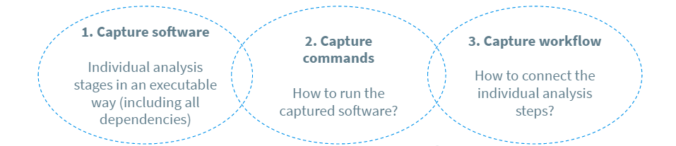

## Open data policies

Providing open data is regulated with open data policies. They can be at the level of

- institutions (institute/ university/ funding agency)
- research groups or collaborations.

Let us first have a look at the data policies for the LHC experiments at CERN. They are at two levels.

CERN has defined an open data policy for the LHC experiments.

Each experiment has its own open data policy that specifies the details of

- what type of data is released
- what else is provided with the actual data (environments, software, workflows)
- what is the amount of data to be released
- what is the timeline for the data releases.

> ## Note!
>
> There are different data "levels". For particle physics data, in particular, we distinguish:
>
> - collision and simulated event data used as input to physics analyses
> - workflows and data products connected to specific analyses.
>
> This may be different in other research fields.
>
{: .callout}

> ## Have a look at the CERN open data policy.
>
> Find out how the four points above are described in the [CERN open data policy](http://cds.cern.ch/record/2745133/files/CERN-OPEN-2020-013.pdf?version=1) (see under "Reconstructed Data (Level 3) Policy").
>
> How does the policy protect the work done within the collaboration?
>
{: .challenge}

> ## Do you have such open data policies?
>
> Discuss what are the policies that apply to your work.
>
{: .discussion}

> ## Open data policy is important!
>
> Data policies can be formal and boring, but they are important! 
>
> - Agreeing upon a policy can be a lengthy process within a group or a collaboration, but it avoids discussing it over and over again.
> - Protecting work done within the collaboration is a key factor in the data policy.
>
{: .testimonial}

## Guidelines for research integrity

Whether or not you are required to provide open data, you should follow a code of conduct for research integrity, see for example [The European Code of Conduct for
Research Integrity](http://www.allea.org/wp-content/uploads/2017/03/ALLEA-European-Code-of-Conduct-for-Research-Integrity-2017-1.pdf). Your institutions may have similar documents.

Two separate topics related to research integrity are of importance in our context:

- Preserving what is necessary for the reproducibility of your research results.
- Agreeing on the use of open data and/or commonly developed software by the members of a research group or a collaboration.

### Preserving what is necessary for the reproducibility of your research results

The European Code of Conduct for Research Integrity lists the following points:

- Under **Research Environment**: 
  - "Research institutions and organisations support proper infrastructure for the management and protection of data and research materials in all their forms (encompassing qualitative and quantitative data, protocols, processes, other research artefacts and associated metadata) that are necessary for reproducibility, traceability and accountability."
- Under **Research Procedures**:
  - "Researchers design, carry out, analyse and document research in a careful and well-considered manner."
  - "Researchers report their results in a way that is compatible with the standards of the discipline and, where applicable, can be verified and reproduced."
- Under **Data Practices and Management**:
  - "Researchers, research institutions and organisations ensure appropriate stewardship and curation of all data and research materials, including unpublished ones, with secure preservation for a reasonable period."

As a researcher, it is your duty to **document and preserve your work**. It is the duty of research institutions to provide proper infrastructure for doing so. And that infrastructure is not your hard drive. 

For your data analysis, preserving your work will consist of three main steps:

{: .image-with-shadow }

We will briefly address this in the context of open data reusability, but remember that this is something that you should do for all your work independently from open data. You are encouraged to have a look at the supplementary material on [best practices]({{ page.root }}/guide/) and to learn more e.g. from the [Reproducible research tutorial](https://coderefinery.github.io/reproducible-research/) by the [CodeRefinery](https://coderefinery.org/) team.

### Agreeing on the use of open data products by the members of a research group or a collaboration

Through open data releases, open data producer/owner waives all rights so that others may freely build upon, enhance and reuse the works for any purposes without restriction under copyright or database law.

It is important to agree within the research group or the collaboration what are the expectations for the **members** of the group/collaboration **on the use of open data**. 

For example, all physics results of CMS go through an internal review process and are published under the full CMS collaboration. For open data, the CMS collaboration has agreed upon internal guidelines that request collaboration members who plan to make studies on open data and publish them under their own names to submit the proposal to the publication committee chair. The proposal can be approved if similar efforts are not planned, or ongoing, within the collaboration.



