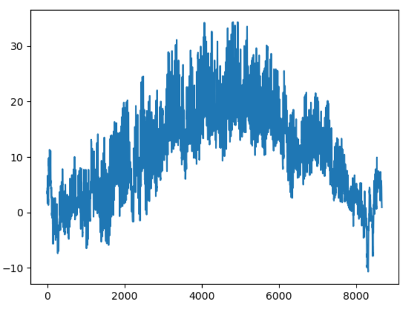

Open data are required to be "FAIR": Findable, Accessible, Interoperable, Reusable.  Let us start with learning more about these FAIR principles.

> ## Read quickly
>
> Read about the [FAIR principles](https://www.go-fair.org/fair-principles/) (3 minutes)
>
{: .callout}

Nice. But what do they mean?

> ## Exercise
>
> Have a concrete look at some open data:
>
> - FINDABLE: find some weather data
> - ACCESSIBLE: download the selected dataset
> - INTEROPERABLE: open the dataset with the tools that you have available
> - REUSABLE: test that you can use these data, e.g plot a value
>
> > ## Solution
> >
> > - Go to e.g. [Austrian weather data](https://data.hub.zamg.ac.at/) -> [datasets](https://data.hub.zamg.ac.at/dataset/) -> [hourly measurements](https://data.hub.zamg.ac.at/dataset/klima-v1-1h)
> > - Select dataset contents (place, e.g. Lufttemperatur 2m TTX, time range) in the [web interface](https://dataset.api.hub.zamg.ac.at/app/frontend/station/historical/klima-v1-1h?anonymous=true)
> > - Download
> > - Open a jupyter notebook, either what you have installed or with the docker container
> >   ~~~
> >   docker run -it --rm -p 8888:8888  jupyter/datascience-notebook
> >   ~~~
> > {: .source}
> > - in the notebook (replace the filename with what you have downloaded):
> >   ~~~
> >   import pandas as pd
> >   import matplotlib.pyplot as plt
> >   data=pd.read_csv('STD Datensatz_20220101T0000_20221227T2300.csv')
> >   plt.plot(data.TTX)
> >   ~~~
> > {: .source}
> > 
> > {: .image-with-shadow }
> {: .solution}
>
{: .challenge}

<!-- add the volume sharing to get the file as in
https://jupyter-docker-stacks.readthedocs.io/en/latest/index.html
this is an html comment -->

> ## Are these data FAIR?
>
> Can we now connect the FAIR qualities of data in this simple exercise to what was described in the [FAIR principles](https://www.go-fair.org/fair-principles/)?
>
> > ## Questions
> >
> > - Can you cite them with a unique identifier?
> > - Can you download them using the identifier?
> > - What about the formal, accessible, shared, and broadly applicable language for knowledge representation??
> >   - Do we understand this correctly?
> > - Can you find:
> >   - rich description of data?
> >   - usage licence?
> >   - detailed provenance, i.e. how these data were taken?
> {: .solution}
{: .callout}

> ## Can you relate to these data?
>
> Does this type of data have anything to do with what you are working on?
>
> > ## Caveat
> >
> > - Research data are usually much more complex.
> > - Temperature is something that people can immediately understand, but most of our reaserch data is not.
> > - The fact that you can plot a temperature from an open dataset does not imply that you can use it in research.
> > - Reusability of research data can hardly ever be simplified to ensuring variable names are explained or self-explanatory.
> >
> {: .solution}
{: .callout}



