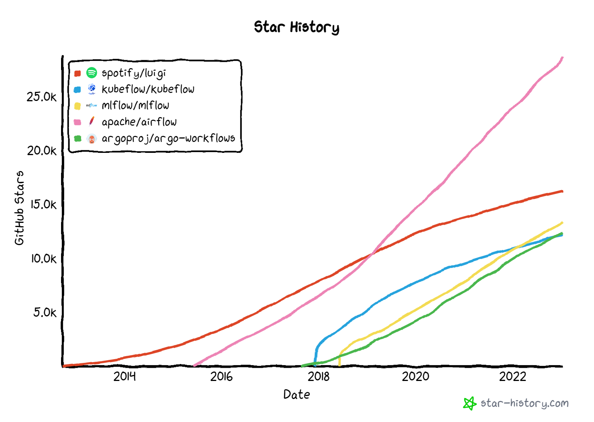

## Best practices

In addition to the topics covered in this lesson, there are many other skills that can help you preserve the analysis knowledge and provide reusable open data.

These skills will help you in the everyday work. Consider the share of your working time spent in coding and computing. It is certainly worth the time to learn some best practices: it will pay off very soon and you could spend less time in struggling with the code and more time in your actual research.

### Code management with git

First and foremost is the use of a code management system allowing versioning, most commonly [`git`](https://git-scm.com/) in connection with GitHub or GitLab as a repository. You should use it not only for getting the code that you use but also for safeguarding your own code. Consider all code that is not pushed to a repository potentially lost at any moment. This is particularly true for notebooks that are easy to modify interactively. The few extra steps to push the latest and greatest version of your notebook to a repository can save you a lot of time when you need to get back to it after a while.

Good resources to learn more:

- git basics in the [Version Control with Git](https://swcarpentry.github.io/git-novice/) lesson by SWCarpentry
- the [Pro Git](https://git-scm.com/book/en/v2) book
- the [GitHub documentation](https://docs.github.com/en)
- the [GitLab tutorials](https://docs.gitlab.com/ee/tutorials/) 

### CI/CD tests

CI and CD stand for continuous integration and continuous delivery/continuous deployment and, in simple terms, means that every time you make changes to your code and "integrate" the updated code to the repository, you run a test that verifies that it still works as expected. "Delivery" or "Deployment" refer to a usual software product lifecycle when a new version of the product is released. In the research world, this can correspond to a release of group-specific software package or, for your own code, the state of the software when you use it your research work.

GitHub and GitLab offer a functionality for automating these tests:

- [GitHub actions](https://github.com/features/actions)
- [GitLab CI/CD pipelines](https://docs.gitlab.com/ee/ci/pipelines/)

Combined with the software containers, they are also a powerful tool to verify that you have packaged everything that is needed in your workflow scripts and/or in the container.

For GitHub actions, you can have a look at some simple implementations in the worflow definitions of

- [POET software](https://github.com/cms-opendata-analyses/PhysObjectExtractorTool/blob/2015MiniAOD/.github/workflows/main.yml)
- [simplified Higgs analysis example](https://github.com/cms-opendata-analyses/HiggsTauTauNanoAODOutreachAnalysis/blob/master/.github/workflows/main.yml).

> ## Exercise!
> Upload a script to a GitHub repository and define a CI/CD test as a GitHub action using the container you built.
>
{: .challenge}

In these simple implementations, an already built container image is used. Note that both GitHub and GitLab have functionalities to build and push a new image in the CI/CD step.

You can also have a look at the self-study tutorial material in the [analysis preservation training](https://indico.cern.ch/event/1219810/timetable/) offered to students and researchers in the high-energy physics domain.

### Computational workflow engines

> ## Definition:
> "A computational workflow is a formalised chain of software tools, which explicitly defines how data is input, how it flows between tools and how it is output. Computational workflows are widely used for data analysis and enable rapid innovation and decision making.
>
> The most important benefit of computational workflows is that they require a user to write down, fully formalise and automate their dataflow and process. While this can be a challenge, it allows greater repeatability, shareability and robustness to be achieved."
>
> (credit: taken from a [tutorial for CWL](https://carpentries-incubator.github.io/cwl-novice-tutorial/01-introduction/index.html), "Common Workflow Language")
{: .testimonial}

There are several open-source computational workflow engines that can be used to combine different steps of analysis workflow, e.g.

- [airflow](https://airflow.apache.org/)
- [luigi](https://github.com/spotify/luigi)
- [mlflow](https://mlflow.org/) 
- [argo workflows](https://argoproj.github.io/workflows)
- [kubeflow](https://www.kubeflow.org/)

out of which mlflow and kubeflow are machine-learning oriented.

The number of people that have "starred" their code repositories give some indication on their popularity ([source](https://star-history.com/#spotify/luigi&kubeflow/kubeflow&mlflow/mlflow&apache/airflow&argoproj/argo-workflows&Date)).


